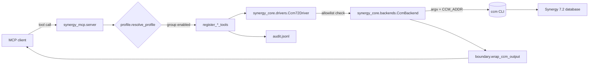

# synergy-mcp Architecture

**Contents:** [Scope](#scope) · [Stack](#stack) · [Repo layout](#repo-layout) · [Runtime flow](#runtime-flow) · [Session model](#session-model) · [Safety invariants](#safety-invariants) · [Knowledge layers](#knowledge-layers) · [Audit](#audit) · [Phase roadmap](#phase-roadmap)

This is the canonical architecture document. `docs/plan/` records how the decisions were reached; this file records what is true now.

---

## Scope

`synergy-mcp` exposes an **IBM Rational Synergy 7.2** database to an AI agent through the `ccm` command-line client.

- **Phase 1 is read-only.** No object is created, modified, checked out or deleted. Write tools are not merely unimplemented — they are rejected by the policy layer.
- The server runs **on the same host as the `ccm` client** (Windows or Linux). There is no SSH hop; the backend is a local `subprocess`.
- Target CLI is **Synergy 7.2**. Command syntax is pinned by a driver (`Ccm72Driver`) so a future 7.1 or 6.5 driver can differ without touching the tool layer.

## Stack

| Layer | Choice | Why |
|---|---|---|
| MCP framework | `mcp>=1.2,<2.0` / FastMCP | Decorator-based tool and resource registration; pinned below 2.0 because this server imports `mcp.server.fastmcp`. |
| Language | Python ≥ 3.10 | PEP 604 unions, dataclasses, `dict[str, str]` builtins. |
| Transport to Synergy | `subprocess` with **argv lists** | Never `shell=True`; query expressions are full of quotes. |
| Config | `inventory.yaml` (facts) + `.env` (secrets) | Secrets never enter the repo or the model's context. |
| Packaging | hatchling, one `pyproject.toml` per package | Capability packages deployable standalone or combined. |

## Repo layout

```
synergy-ccm-mcp/                      <- repo root
├── tool_profile.config.json          # profile + group flags
├── synergy-mcp-server/
│   ├── packages/
│   ├── skills/                      # served-only SKILL.md files
│   │   ├── synergy-core/             # shared mechanism: audit, boundary, scope,
│   │   │                             #   safety, paths, inventory, formats,
│   │   │                             #   drivers/, backends/
│   │   └── synergy-db/               # the read tools over a Synergy database
│   ├── server/
│   │   └── synergy_mcp/              # combined server: profile, runtime, tools/
│   ├── skills/                       # AI knowledge layer (SKILL.md)
│   ├── commands/                      # slash-command definitions
│   ├── docs/
│   ├── scripts/
│   └── logs/                          # audit.jsonl (gitignored)
```

**Why the split:** `packages/` holds capability packages that can each run as their own MCP server; `server/` is the combined server that registers every enabled group. `skills/` is client-side knowledge and is never executed server-side.

## Runtime flow



Every call passes three gates before reaching `ccm`:

1. **Profile** — is the tool's group registered at all?
2. **Driver allowlist** — is this verb read-only for this Synergy version?
3. **Argument validation** — do object names contain quote/control characters that could break out of a query literal?

## Session model

Starting a `ccm` session is slow and consumes a **floating licence seat**, so sessions are pooled:

- One long-lived session per inventory database, keyed by name, guarded by a per-database lock.
- The session's `CCM_ADDR` is injected into the environment of each `ccm` invocation.
- A stale session (`not a valid session`, `session has been terminated`) triggers exactly one transparent restart-and-retry.
- Sessions **started** by the server are stopped at shutdown. Sessions the server merely **attached** to (operator supplied `SYNERGY_<DB>_CCM_ADDR`) are left running.

Attach mode is the recommended production posture: a human starts the session, the server never handles a password.

## Safety invariants

1. **Read allowlist.** Only verbs in `Ccm72Driver.read_whitelist` may run. Anything else is refused by name.
2. **Permanent denylist.** `delete`, `rename`, `archive`, `migrate`, `purge`, `db`, `dcm`, `typedef`, `users` are blocked regardless of profile, flag or confirmation.
3. **Mutating sub-flag detection.** `ccm task` and `ccm attribute` are read verbs whose sub-flags can mutate. `-create`, `-modify`, `-delete`, `-complete`, `-checkin`, `-associate`, `-set` and friends are rejected.
4. **No shell.** All execution is `subprocess.run(argv, shell=False)`. Query expressions are passed as a single argv element.
5. **Object-name validation.** Names interpolated into query expressions must match a conservative pattern; quotes and control characters are refused.
6. **Session commands are internal.** `ccm start` / `ccm stop` cannot be invoked as tools; only the session pool runs them.
7. **Untrusted output boundary.** Everything Synergy returns is wrapped at one seam (`wrap_ccm_output`). Source code, task synopses and check-in comments are attacker-influenced text and are treated as data, never instructions.
8. **Credential redaction.** `-pw` values are masked before any command string reaches a log or the model.
9. **Result caps.** `ccm query` on a real database can return six figures of rows; `max_rows` truncation is enforced and reported, never silent.
10. **Defence in depth.** The same rules are stated in `skills/synergy-core/SKILL.md` so the model refuses first, and enforced in the server so it is refused anyway.

## Knowledge layers

| Layer | Lives in | Loaded |
|---|---|---|
| Safety + workflow rules | `skills/synergy-core/SKILL.md` | Session start |
| Query-language grammar + recipes | `skills/synergy-query-language/SKILL.md` | On demand |
| Object model and object inspection | `skills/synergy-object-model/SKILL.md` | On demand |
| Task, release, project and baseline workflows | `skills/synergy-task-project/SKILL.md` | On demand |
| Exact `ccm` syntax and IBM/manual reference lookup | `skills/synergy-knowledge-corpus/SKILL.md` | On demand |
| Runtime troubleshooting | `skills/synergy-troubleshooting/SKILL.md` | On demand |
| Harvested `ccm help` and manual corpus | `build/synergy-knowledge.sqlite` | On demand via `knowledge_search` |

Skills are served to clients as `synergy://skills/<name>` resources so a non-filesystem client gets identical knowledge. They are not embedded into Claude Desktop MCPB or VS Code install artefacts.

## Audit

Append-only JSONL at `logs/audit.jsonl`, one record per tool call:

```json
{"ts": "2026-08-15T14:23:47.123456+00:00", "event": "ccm_query", "database": "prod-core", "ok": true, "detail": "cvtype='task' and owner='uzi'"}
```

Secrets are redacted before write. See [ccm-contract.md](ccm-contract.md) for the full schema.

## Phase roadmap

| Phase | Content | Status |
|---|---|---|
| 1 | Read-only: query, object, task, project groups | in progress |
| 2 | Knowledge corpus (`ccm help` harvest + manual ingest, FTS5) | planned |
| 3 | Task management writes (`create`/`complete`) behind stage → commit | planned |
| 4 | Checkout/checkin, work-area operations | not scheduled |

Phase 3 introduces a staged-write flow: `stage_change` returns a preview and touches nothing, `commit_change(stage_id, confirm=true)` applies it after explicit human approval, with an automatic pre-change snapshot.
